  <h1>Hi, I'm Vansh Bhardwaj 👋</h1>
  <h3>Aspiring Data Scientist | Business Intelligence & Analytics</h3>

  

   

  
  
  
  

## 🚀 About Me

I'm a detail-oriented **BCA student specializing in AI & Data Analytics** at LNCT University, Bhopal, passionate about turning raw, messy data into clear, actionable business insight.

- 🔭 Currently deepening my skills in **predictive modeling, statistical analysis, and dashboarding**
- 🌱 Learning to connect technical data science work with real-world **business objectives**
- 💬 Comfortable working across the full pipeline — from data cleaning to storytelling with visuals
- 📫 Open to internships and entry-level roles in **Data Science / Analytics / BI**

<h2>🎓 Education</h2>

| | |
|---|---|
| 🏫 **Program** | Bachelor of Computer Applications — AI & Data Analytics (BCA AIDA) |
| 🏛️ **Institution** | LNCT University, Bhopal |
| 📅 **Duration** | 2024 – 2027 (Ongoing) |
| 🏆 **Standing** | Department topper · CGPA: **9.22** |
| 📚 **Coursework** | Machine Learning, Data Science, Statistics & Probability, Data Visualization, Advanced Mathematics |

## 🛠️ Tech Stack & Skills

                

## 📌 Featured Projects

<table>
<tr>
<td width="100%">

### 🤖 Machine Learning Algorithms

- **Objective:** Built a growing collection of ML algorithms from scratch, from beginner to advanced level, documented in well-structured Jupyter Notebooks.
- **Coverage:** Implemented supervised methods (Linear/Logistic Regression, Decision Tree, Random Forest, SVM, KNN, Naive Bayes) and unsupervised methods (K-Means, Hierarchical Clustering, DBSCAN, PCA).
- **Evaluation:** Practiced model evaluation techniques — cross-validation, confusion matrices, precision/recall/F1, ROC-AUC, RMSE, and R².
- **Impact:** Serves as a personal ML reference library and portfolio piece demonstrating both implementation and mathematical understanding.

</td>
</tr>
</table>

<table>
<tr>
<td width="100%">

### 🎬 Netflix Content Analysis

- **Objective:** Investigated a dataset of 8,000+ Netflix titles to uncover trends in genres, formats, and regional production over time.
- **Data Processing & EDA:** Conducted rigorous EDA with Pandas and NumPy — missing value imputation, data normalization, and feature extraction.
- **Impact:** Synthesized findings into a structured report and slide deck to communicate insights clearly to non-technical stakeholders.

</td>
</tr>
</table>

<table>
<tr>
<td width="100%">

### 📱 Realme Smartphone Market Analysis

- **Objective:** Analyzed a real-world Realme smartphone dataset to extract insights on pricing strategy, feature trends, and consumer preferences.
- **Data Processing:** Performed end-to-end cleaning — handled missing values, removed duplicates, and standardized data types across multiple CSV files.
- **Exploratory Analysis:** Used Pandas and NumPy to study price distributions, RAM/storage variation, and battery capacity trends.
- **Key Finding:** Identified a strong correlation between higher specs and pricing spikes, and pinpointed the most preferred configurations in the mid-range segment.

</td>
</tr>
</table>

<table>
<tr>
<td width="100%">

### 📊 AEO Report Generator

- **Objective:** Built a full-stack web app with separate backend and frontend that generates AEO (Answer Engine Optimization) reports.
- **Architecture:** Structured the project into distinct backend and frontend layers, deployed live for public use.
- **Impact:** Delivered a working, deployed tool rather than just a notebook — bridging data analysis skills with product-style delivery.

</td>
</tr>
</table>

<table>
<tr>
<td width="100%">

### 🧹 Cleanytics — AI-Powered Data Cleaning & Analytics Platform

- **Objective:** Designed a product concept and frontend for a platform that turns messy business spreadsheets into clean, dashboard-ready data.
- **User Flow:** Built the experience around sign-in, CSV/Excel upload, automated cleaning, and dashboard review of results.
- **Stack:** React frontend (Vite) with a planned FastAPI/Flask + PostgreSQL backend for authentication, file handling, and analytics APIs.
- **Status:** Actively iterating — Version 2 added dashboard triggers, bug fixes, and a one-click local startup script.

</td>
</tr>
</table>

<table>
<tr>
<td width="100%">

### 📒 AccAI — AI-Powered Accounting Intelligence

- **Objective:** Built an AI-powered accounting system that converts raw transaction data into structured journal entries and ledgers.
- **Automation:** Automated generation of trial balances, Trading Account, Profit & Loss, and Balance Sheet from unstructured inputs.
- **Impact:** Combined NLP/AI techniques with core accounting logic to reduce manual bookkeeping effort.

</td>
</tr>
</table>

## 📊 How I Allocate Time in Data Science Projects

  

> This is a **real animated chart** (SVG + SMIL) — the donut draws itself and the legend bars grow in automatically on page load.

## 📈 GitHub Activity & Stats

<table>
<tr>
<td width="50%" align="center">

</td>
<td width="50%" align="center">

</td>
</tr>
<tr>
<td colspan="2" align="center">

</td>
</tr>
</table>

  <i>Thanks for stopping by — always happy to connect and talk data!</i>

